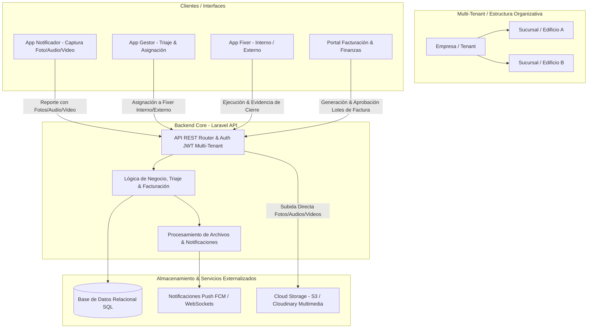
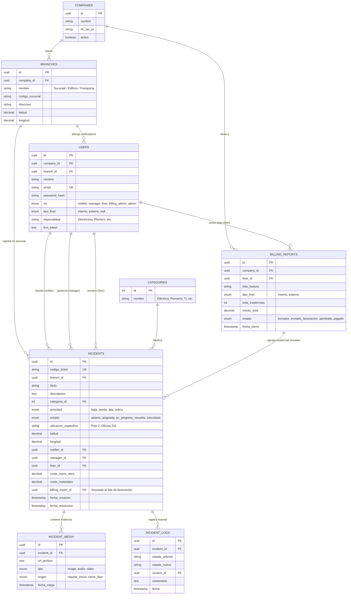

# Inshidento 🛠️ - Ecosistema Digital de Gestión de Incidencias

**Inshidento** es un ecosistema tecnológico multi-empresa centralizado diseñado para simplificar, acelerar y dar trazabilidad completa a la gestión de fallas de infraestructura en entornos operativos complejos (edificios corporativos, plantas industriales, cadenas de franquicias, sucursales comerciales y complejos residenciales).

---

## 🎯 Objetivo de la App

El objetivo principal de **Inshidento** es eliminar la fragmentación y la opacidad en la resolución de incidencias (eléctricas, plomería, mantenimiento general, TI), conectando en tiempo real a los **Notificadores** (quienes detectan y capturan la falla con evidencia multimedia), los **Gestores** (quienes priorizan y asignan), los **Fixers** (técnicos internos o contratistas externos) y el **Área de Facturación/Finanzas**.

### Problemas y Necesidades Operativas que resuelve:
* **Captura Enriquecida de Evidencia:** Levantamiento obligatorio y estructurado de fotos, notas de audio y videos cortos durante el reporte inicial y en el cierre de la incidencia.
* **Estructura Multi-Empresa y Sucursales:** Gestión jerárquica para albergar múltiples empresas independientes, cada una con sus propias sucursales, franquicias, edificios o puntos agrupadores de levantamiento.
* **Módulo de Facturación y Liquidación:** Agrupación de incidencias resueltas/cerradas en reportes consolidados o individuales dirigidos al área de finanzas para el pago a **Fixers Externos** (proveedores/contratistas) o compensación/control de horas de **Fixers Internos** (personal de plantilla).
* **Tiempos de respuesta lentos y desorden:** Triaje inmediato, asignación directa o por cola pública y trazabilidad en tiempo real.

---

## 🏗️ Arquitectura de Software

El sistema utiliza un patrón de **Arquitectura Cliente-Servidor Desacoplada** con soporte **Multi-Tenant (Multi-Empresa)**, compuesto por un Backend en API REST centralizada y cuatro interfaces frontend especializadas según el perfil operativo.

### Componentes de la Arquitectura:

1. **Backend Central (Laravel PHP 8.x - Multi-Tenant):**
   * **API RESTful protegida con JWT / Sanctum:** Lógica de negocio multi-empresa, aislamiento de datos por tenant, validación de reglas de acceso y autorización por roles.
   * **Mapeo de Puntos Agrupadores:** Asociación jerárquica de `Empresas -> Sucursales / Edificios -> Zonas / Notificadores`.
   * **Módulo de Facturación y Liquidación:** Agrupación de tickets cerrados en lotes de facturación (`billing_reports`) para proveedores externos o reportes de nómina/costos para fixers internos.
   * **Manejo de Colas (Queues):** Procesamiento de imágenes, notas de audio, transcodificación de videos y notificaciones push.

2. **Clientes Especializados:**
   * **App del Notificador:** Levantamiento ultra-rápido en campo capturando la ubicación exacta dentro de la sucursal/edificio y adjuntando evidencia en foto, audio explicativo o video.
   * **App del Gestor:** Consola de mando para triaje, clasificación de fallas, asignación inteligente a Fixers Internos o contratación de Fixers Externos.
   * **App del Fixer (Interno / Externo):** Gestión de tareas asignadas o de la cola pública, inicio/pausa de trabajo y subida de evidencia de cierre (foto/video + firmas/costos de repuestos).
   * **Portal de Facturación y Finanzas:** Módulo web para revisión de incidencias cerradas, aprobación de paquetes de cobro de contratistas externos y auditoría de costos.

3. **Infraestructura Multimedia:**
   * **Almacenamiento Multimedia en la Nube:** AWS S3 o Cloudinary optimizado para compresión de imágenes (JPG/HEIC), compresión de audio (AAC/MP3) y streaming de video corto (MP4).

---

## 🗄️ Modelo de Base de Datos (BD)

Base de datos relacional (**PostgreSQL** o **MySQL**) diseñada para soportar multi-tenancy, jerarquía de sucursales, captura multimedia avanzada y liquidación/facturación.

### Diagrama Entidad-Relación:

---

## 👥 Público Objetivo

* **Empresas, Holdings y Cadenas de Franquicias:** Corporativos con múltiples sucursales, tiendas de retail, sucursales bancarias, administradoras de edificios o plantas industriales.
* **Departamentos de Facturación y Finanzas:** Contadores y administradores encargados de la revisión de horas/servicios ejecutados, conciliación de facturas de proveedores externos y liquidación de costos de mantenimiento.
* **Gestores y Coordinadores de Mantenimiento:** Supervisores que asignan las incidencias priorizando la especialidad y el costo entre Fixers Internos o Contratistas Externos.
* **Fixers Internos y Externos:**
  * **Fixers Internos:** Personal técnico contratado directamente por la empresa que cumple turnos y resuelve incidencias como parte de su jornada.
  * **Fixers Externos:** Contratistas independientes, técnicos freelance o empresas de servicios tercerizados que cobran por trabajo realizado y requieren enviar sus agrupaciones de tickets a facturación.
* **Notificadores (Empleados de Sucursal / Edificio):** Personal que labora en las distintas sucursales y necesita reportar inmediatamente cualquier fallo capturando fotos, audios explicativos o video corto.

---

## 🚀 Proyección de Avances (Roadmap)

### 📌 Corto Plazo (0 - 3 Meses)
* [x] Definición de arquitectura multi-tenant, flujo de facturación y modelo relacional de datos.
* [ ] Implementación de la API REST Core en Laravel (Auth JWT, Tenants, Empresas y Sucursales).
* [ ] Ingesta y subida de evidencias multimedia en 3 formatos (**Foto, Audio notas de voz y Video corto**) para el reporte del notificador y el cierre del fixer.
* [ ] CRUD de Incidencias, roles y gestión de usuarios (Fixer Interno vs. Fixer Externo).

### 📍 Mediano Plazo (3 - 6 Meses)
* [ ] **Módulo de Facturación y Liquidación:** Selección y agrupamiento de incidencias en estado `resuelta/cerrada` para generar reportes consolidados o individuales enviados al área de finanzas.
* [ ] Mecanismo de cola de trabajo pública con botón de reclamo (*claim*) diferenciando tarifas/asignaciones para fixers externos.
* [ ] Soporte para modo **Offline-First** en las apps móviles con sincronización diferida de audios, fotos y videos al recuperar señal.
* [ ] Panel de control con desglose financiero: costos de mantenimiento por sucursal, costos por fixer externo vs. interno y tiempos de resolución.

### 🗺️ Largo Plazo (6 - 12+ Meses)
* [ ] Integración vía API con sistemas ERP/Contables (ej. SAP, QuickBooks, Odoo) para el timbrado e ingreso automático de facturas de los fixers externos.
* [ ] Asignación inteligente por geolocalización de contratistas externos según tarifas y cobertura de sucursal.
* [ ] Módulo de **Mantenimiento Preventivo Programado** con alertas de vencimiento por sucursal o edificio.
* [ ] Integración con sensores IoT de infraestructura (medidores de energía, detectores de humo y fugas) para creación automatizada de incidencias por sucursal.

---

## 🤖 Posibilidades de Integración y Uso de Inteligencia Artificial (IA)

1. **Análisis Multimodal de Evidencia (Foto y Video):**
   * **Uso:** Modelos de visión por computadora (ej. Gemini Vision) analizan la foto o video subido por el notificador para identificar la falla automáticamente y verificar que la foto de evidencia de cierre del fixer efectivamente muestra el problema resuelto (comparativa Antes vs. Después).

2. **Transcripción y Procesamiento de Audios de Reporte (Speech-to-Text & NLP):**
   * **Uso:** Transcripción automática de las notas de audio grabadas por el notificador en la sucursal, sintetizando la descripción en texto formateado y extrayendo los detalles técnicos clave para el fixer.

3. **Auditoría Automatizada de Facturación y Costos de Fixers Externos:**
   * **Uso:** Agentes de IA que auditan los costos de materiales y mano de obra incluidos en las incidencias agrupadas para facturación, comparándolos con tabuladores de precios de mercado y detectando desviaciones o sobrecostos inusuales antes de enviar la liquidación al área contable.

4. **Asignación Inteligente (Fixer Interno vs. Contratista Externo):**
   * **Uso:** Algoritmo que decide si la incidencia conviene ser asignada a un fixer interno en turno (para minimizar costos) o derivarla a un fixer externo especializado (por urgencia o complejidad técnica).

5. **Predicción de Presupuesto de Mantenimiento por Sucursal:**
   * **Uso:** Modelos predictivos que proyectan el gasto en reparaciones y reemplazos por sucursal o edificio basándose en el comportamiento histórico de incidencias.

---

## 📄 Licencia

Este proyecto está bajo la licencia [MIT](LICENSE).
